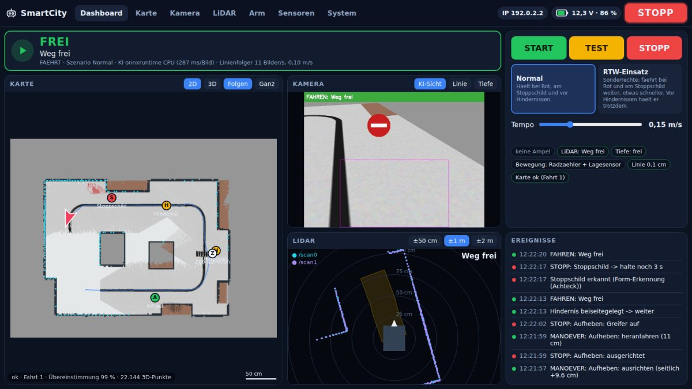
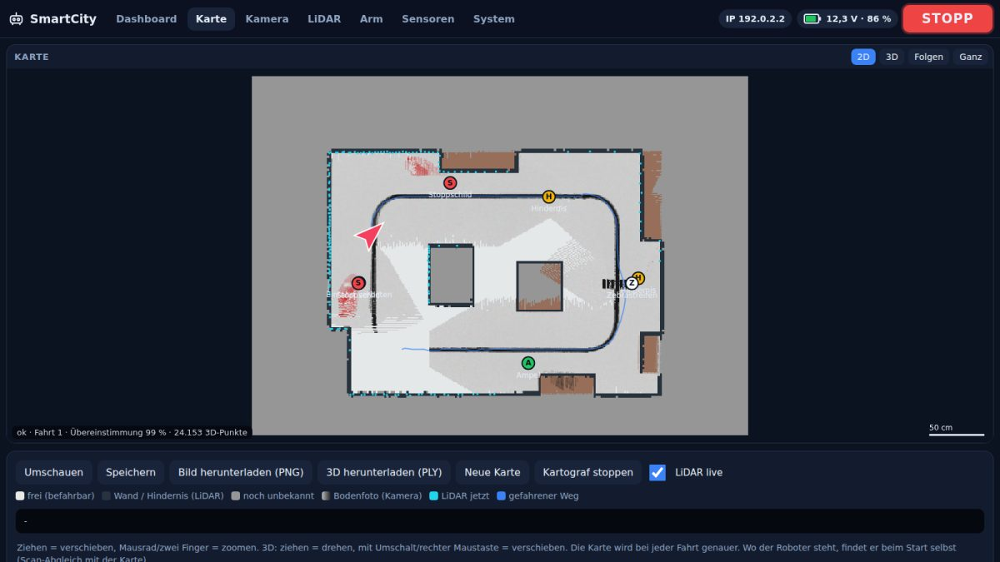
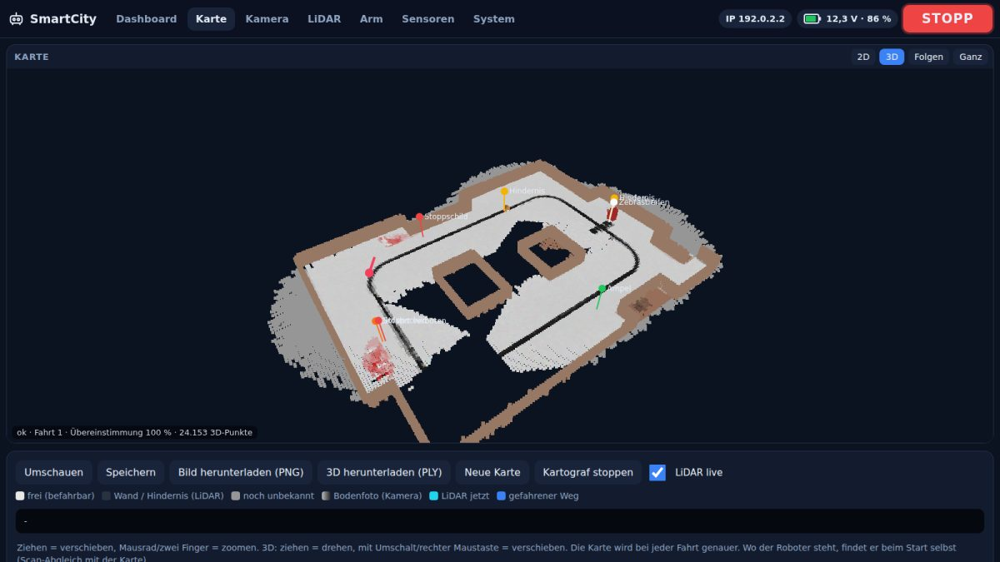
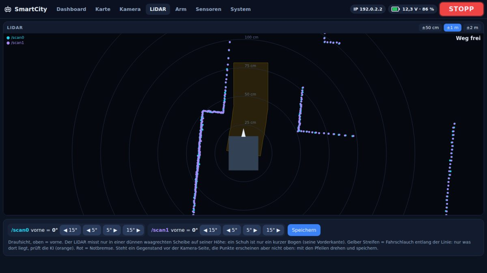
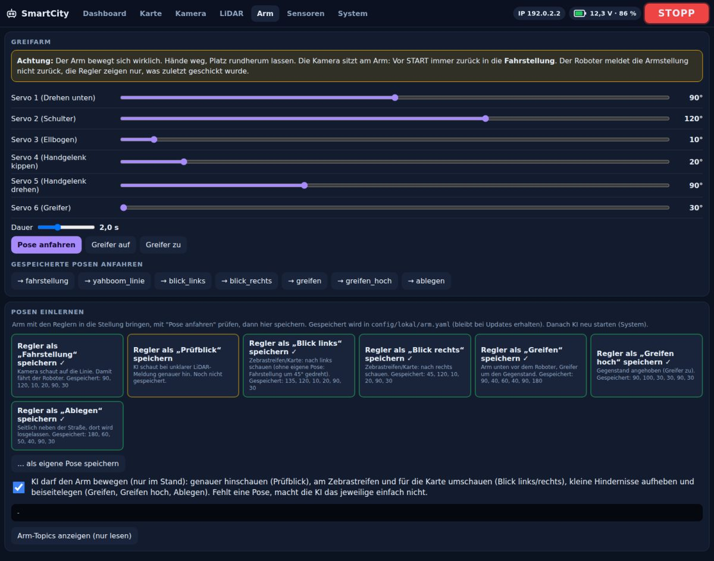

# SmartCity 2026 – Autonomes Fahren

Software für den Yahboom ROSMASTER M3 Pro (Jetson Orin, Ubuntu 22.04, ROS 2 Humble) in der SmartCity der BBS Trier.
**Repository:** https://github.com/davidheinrich73/smartcity-roboter · **Bisher nur auf RM02 programmiert und getestet.**

Der Roboter folgt der schwarzen Linie. Eine **KI** beachtet Ampeln, Stoppschilder, Zebrastreifen, Einbahnstraßen und Hindernisse. Ein **Kartograf** baut bei jeder Fahrt eine 2D- und 3D-Karte. Bedient wird alles über das **Panel**.

👉 Ausführliche, verständliche Erklärung (zum Vortragen): **[docs/projekt.md](docs/projekt.md)**



## Installieren (einmal pro Roboter)

```bash
cd ~
git clone https://github.com/davidheinrich73/smartcity-roboter.git   # Projekt herunterladen
cd ~/smartcity-roboter
scripts/installieren.sh          # Panel-Symbol ins Dock, Roboter-Name, KI-Bibliothek
```

`installieren.sh` am Bildschirm des Roboters ausführen, nicht über SSH. An Yahboom-Dateien und am Autostart ändert es nichts.

**Update:** Panel → System → „Neueste Version holen“ (oder `scripts/update.sh`). Danach das Panel neu öffnen. Eigene Einstellungen in `config/lokal/` bleiben erhalten.

## Benutzen

1. Im Dock auf **SmartCity Panel** klicken. Das startet Kamera, KI, Kartograf und das Panel.
2. **TEST**: Der Roboter zeigt alles an, fährt aber nicht. **Immer zuerst testen.**
3. **START**: Er fährt. **STOPP**: Er hält sofort an. Der STOPP-Knopf ist auf jeder Seite oben rechts.
4. Panel-Fenster schließen = Roboter hält an, alle Programme werden beendet.

**Vom Laptop:** Panel → System → „Laptop-Zugriff erlauben“, dann die angezeigte Adresse öffnen, z. B. `http://10.0.12.62:8080`.
**Not-Aus von außen:** `scripts/stopp.sh`

| Karte (2D) | Karte (3D) |
|---|---|
|  |  |
| **LiDAR mit Fahrschlauch** | **Arm: Stellungen einlernen** |
|  |  |

Das Dashboard passt auch auf den 7-Zoll-Bildschirm des Roboters (1024×600) und aufs Handy.

## Einstellen (vor der ersten Fahrt)

| Was | Wo |
|---|---|
| LiDAR-Richtung „vorne“ | Panel → LiDAR, mit den Pfeilen drehen, Speichern |
| Arm-Stellungen (Fahrstellung zuerst) | Panel → Arm |
| Kamera-Neigung und -Höhe nachmessen | `config/lokal/roboter.yaml`, siehe [docs/linie.md](docs/linie.md) |
| Ampel-LED-Farben | `scripts/ampel_kalibrieren.sh` |

## Was steckt wo?

| Ordner | Inhalt |
|---|---|
| `line_follower/` | Linienfolger (Draufsicht, Linien-Gedächtnis, Lenkung) |
| `ki/` | KI-Zentrale und Entscheidungsregeln |
| `kartograf/`, `lib/karte.py` | Karte 2D/3D |
| `panel/` | Bedienoberfläche (Webseite) |
| `sim/` | Simulation ohne Roboter |
| `scripts/` | Start-, Test- und Hilfsskripte |
| `config/` | Standardeinstellungen; eigene Werte in `config/lokal/` (nicht im Repository) |
| `docs/` | Doku: [Projekt](docs/projekt.md), [KI](docs/ki.md), [Linie](docs/linie.md), [Karte](docs/karte.md), [Greifarm](docs/greifarm.md), [Roboter](docs/roboter.md), [Browser](docs/browser.md) |

## Testen ohne Roboter

```bash
python3 tests/test_entscheider.py   # Regeln der KI
python3 tests/test_karte.py         # Karte
scripts/simulation.sh pruefen       # komplette Fahrt in der Simulation (braucht ROS 2)
python3 tests/panel_demo.py         # Panel mit Beispieldaten, http://localhost:8099
```

## Stand

**Offen:**
- Kreuzungen und Abbiegen nach Stadtplan (K1–K8), Wegwahl, „fahr zu X“
- Abblendlicht an der LED-Leiste und Blinker beim Abbiegen
- MQTT für die Leitzentrale
- Objekte wegräumen: Die Arm-Bewegungen soll die KI selbst erlernen statt fest vorprogrammiert
- Alle vier Roboter gleichzeitig: Dafür braucht jeder eine eigene Domain-ID ([docs/roboter.md](docs/roboter.md))

**Bekannte Fehler:**
- Die Kartierung funktioniert manchmal nicht richtig.
- Beim Greifer sind „zugreifen“ und „öffnen“ vertauscht.
- Teilweise KI-Aussetzer (unter 2 s).
- Die Objekterkennung ist teilweise fehlerhaft, Ampeln werden noch nicht sauber erkannt.

Alles Neue ist zuerst in der Simulation getestet. Gerätetests auf RM02 laufen.
