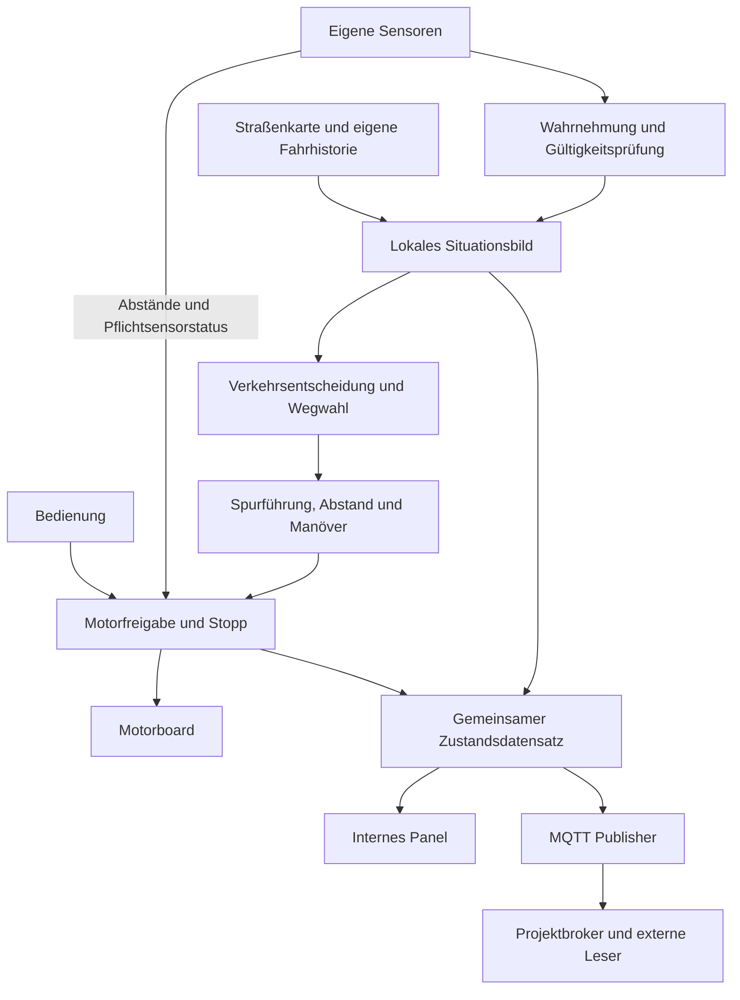

# Zieldefinition des Grundbetriebs der SmartCity Roboter

**Stand:** 02.10.2026  
**Version:** 1.0  
**Geltungsbereich:** RM01, RM02, RM03 und RM04 auf dem SmartCity-Spielfeld  
**Zweck:** Gemeinsame Entwicklungsbasis für Verhalten, Sensorik, Steuerung, Datenbereitstellung und Abnahme.

Das fachliche Zielbild wurde von Carsten bestätigt. Diese Datei hält es einschließlich der Ergänzungen zur Spurtreue und zur gemeinsamen Datenbasis für MQTT und Panel fest. Sie beschreibt den zu entwickelnden Zustand und behauptet keine bereits bestandene Geräteabnahme.

Die Anforderungen dieses Dokuments sind für den beschriebenen Grundbetrieb maßgeblich. Frühere Unterlagen, die nur eine kurze Grundfahrt oder MQTT als nachgelagerte Erweiterung beschreiben, gelten insoweit als frühere Planung. Die kurze Einzelfahrt bleibt ein Entwicklungsmeilenstein. Kreuzungsnavigation, gleichzeitiger Vierroboterbetrieb und MQTT-Telemetrie gehören jetzt zum vollständigen Grundbetrieb.

Technische Lösungsvorschläge, beispielsweise Kreuzungsmarkierungen und die Topic-Struktur, sind ausdrücklich als Vorschläge gekennzeichnet. Messwerte, Termine und noch nicht abgestimmte Infrastrukturregeln werden nicht als bereits beschlossen dargestellt.

## 1. Gemeinsames Ziel

Die vier Roboter RM01–RM04 bewegen sich gleichzeitig, kontinuierlich und autonom durch das Straßensystem der SmartCity. Jeder Roboter steuert seine Fahrt anhand seiner eigenen Sensoren und einer lokal verfügbaren Beschreibung der Straßenregeln. Direkte Kommunikation zwischen Robotern zur Abstimmung ihrer Fahraktionen ist nicht erforderlich und nicht Teil des Grundbetriebs.

Die Roboter folgen den vorgesehenen Leitlinien, beachten Einbahnrichtungen, Verkehrsampeln, Verkehrsschilder und beide Zebrastreifen. Sie halten Abstand zu vorausfahrenden Robotern und reagieren auf Hindernisse. An Verzweigungen wählen sie selbstständig zwischen erlaubten Ausfahrten. Die Auswahl soll einen abwechslungsreichen, lebendigen Stadtverkehr erzeugen.

**Spurtreue und Schutz des Aufbaus haben Vorrang vor Bewegungsfortschritt.** Kein Roboter darf Häuser, Ampeln oder andere Aufbauten anfahren, umwerfen oder durch seine Bewegung beschädigen. Dies gilt für die gesamte Fahrzeughülle einschließlich Arm, Kamera und herausragender Teile. Ein Hindernis wird nicht durch Verlassen der vorgesehenen Linie umfahren; der Roboter hält an und wartet.

Alle Betriebs-, Wahrnehmungs- und Diagnosedaten des Grundbetriebs werden aus einer gemeinsamen Datenquelle für das interne Panel und für MQTT bereitgestellt. Im Grundbetrieb muss ein MQTT-Client die veröffentlichten Daten der vier Roboter über den Projektbroker lesen können. Das Panel zeigt die gleichen fachlichen Werte mit ihrem Zeitbezug und ihrer Gültigkeit.

## 2. Umfang und Systemgrenzen

### 2.1 Zum Grundbetrieb gehören

- Gleichzeitiger Betrieb aller vier Roboter mit derselben geprüften Anwendung und Straßenkarte.
- Lokale Wahrnehmung, Spurführung, Kreuzungserkennung, zulässige Wegwahl und Abbiegen.
- Verkehrsregeln, Abstandhalten, Hindernishalt und kontrollierte Wiederanfahrt.
- Verlässliche Betriebszustände, Bedien-STOPP, Fehlererkennung und nachvollziehbare Rückmeldungen.
- Sinnvolle Nutzung der vorhandenen Sensoren in einem gemeinsamen Situationsbild.
- Tatsächliche MQTT-Veröffentlichung und ein internes Panel auf derselben Zustandsquelle.
- Dokumentierte Geräteparameter, Schnittstellen und reproduzierbare Abnahmen.

### 2.2 Nächstes Sprungziel

Die Leitzentrale soll später über MQTT Szenarioaufträge erteilen können, beispielsweise einen Feuerwehreinsatz an einem SmartHome oder einen Müllauftrag. Dazu kommen Auftragsannahme, Zielnavigation, Szenarioausführung und Abschlussmeldung. Autonomes Greifen, Aufnehmen oder Ablegen von Gegenständen wird separat entwickelt und geprüft.

Die Architektur des Grundbetriebs muss dafür erweiterbar sein. Im Grundbetrieb werden jedoch noch keine MQTT-Fernfahrbefehle, Einsatzaufträge oder Sonderrechte aktiviert. Die vorhandene Szenariooption zum Übergehen roter Ampeln oder Stoppschilder entspricht nicht dem hier definierten Grundbetrieb.

### 2.3 Zuständigkeiten im Gesamtsystem

| System | Verantwortung |
|---|---|
| Einzelner Roboter | Eigene Wahrnehmung, Orientierung, Fahrwegwahl, Spurführung, Abstand, unmittelbare Hindernisreaktion und Schutz seiner Umgebung. |
| Ampel- und Infrastrukturteam | Verkehrsfreigaben und Sperrungen an Konfliktstellen sowie ein funktionierendes Verfahren für Gegenverkehr. |
| Spielfeldteam | Fahrbare Geometrie, eindeutig platzierte Signale und Schilder sowie ausreichender Abstand der Aufbauten zum Fahrbereich. |
| Netzwerk- und Brokerteam | Erreichbares Projektnetz, Brokerzugang und abgestimmte MQTT-Verbindung. |
| API- und Dashboardteam | Nutzung der vereinbarten Roboterdaten; ein Stadt-Dashboard ist zusätzlich zum internen Panel möglich. |
| Roboterteam | Gemeinsame Software, Gerätezuordnung, Sensorprüfung, Datenvertrag, MQTT-Publisher, internes Panel und Gerätests. |

Ampeln koordinieren Verkehrsfreigaben. Sie ersetzen weder die lokale Abstandregelung noch die unmittelbare Hindernisprüfung des einzelnen Roboters. Der MQTT-Broker verteilt veröffentlichte Nachrichten; er übernimmt keine Fahrentscheidung oder Navigation.

## 3. Spielfeld und Straßenmodell

### 3.1 Referenzbilder

Das Konzeptbild legt die beabsichtigten Richtungen und die dargestellte Infrastruktur zugrunde. Das Foto zeigt die tatsächliche Mattenstruktur mit Leitlinien, Überwegen und Plattenfuge. Maßangaben werden aus keinem der Bilder abgeleitet.


Im Foto sind noch keine aufgebauten Verkehrsampeln, Verkehrsschilder oder Fahrtrichtungspfeile erkennbar. Ihre tatsächliche Montage und Bedeutung müssen mit dem Konzept abgeglichen werden. Die sichtbaren runden Punkte werden ohne Geräteprüfung keinem bestimmten Sensortyp zugeordnet.

### 3.2 Knoten und erlaubte Straßenrichtungen

Das dargestellte Netz besitzt acht Verzweigungsknoten: sechs T-Einmündungen und zwei Kreuzungen. Die folgenden Kennungen sind ein gemeinsamer Benennungsvorschlag:

```text
      ┌←──────── K1 ←─────── K2 ←────────┐
      ↓          ↑          ↓           ↑
      K3 ↔────── K4 ↔────── K5 ↔─────── K6
      ↓          ↑          ↓           ↑
      └────────→ K7 ──────→ K8 ─────────→┘
```

| Knoten | Lage | Typ |
|---|---|---|
| K1 | Obere Einmündung der linken inneren Straße | T |
| K2 | Obere Einmündung der rechten inneren Straße | T |
| K3 | Linkes Ende der Querstraße an der Außenrunde | T |
| K4 | Querstraße trifft linke innere Straße | Kreuzung |
| K5 | Querstraße trifft rechte innere Straße | Kreuzung |
| K6 | Rechtes Ende der Querstraße an der Außenrunde | T |
| K7 | Untere Einmündung der linken inneren Straße | T |
| K8 | Untere Einmündung der rechten inneren Straße | T |

```text
Außenrunde:  K2 → K1 → K3 → K7 → K8 → K6 → K2
Innen links: K7 → K4 → K1
Innen rechts: K2 → K5 → K8
Querstraße: K3 ↔ K4 ↔ K5 ↔ K6
```

Die gebogenen Außenecken sind in dieser Darstellung Teil der Straßenabschnitte. Für jeden Knoten und jede zulässige Zufahrt wird eine Tabelle erlaubter Ausfahrten erstellt. K1 und K8 haben nach den Konzeptpfeilen jeweils nur eine ausgehende Straßenverbindung; dort besteht keine freie Wegwahl.

Die endgültige Karte enthält zusätzlich die Leitliniengeometrie, Haltepunkte, Ampelzuordnung, Überwege, Schilder und gegebenenfalls Sperrbereiche. Sie wird versioniert und auf allen vier Geräten gleich gehalten.

### 3.3 Zweirichtungsstraße

Die Querstraße besitzt im Bild eine gemeinsame Leitlinie für beide Fahrtrichtungen. Zwei entgegenkommende Linienfolger würden denselben Fahrpfad benutzen. Eine lokale Hindernisbremsung allein kann deshalb einen dauerhaften gegenseitigen Stillstand erzeugen.

Vor gemeinsamer Fahrt muss die Infrastruktur ein nachgewiesenes Verfahren für diese Strecke bereitstellen. Vorschlag: Gegenverkehr wird bis zur tatsächlichen Räumung des freigegebenen Bereichs ausgeschlossen. Dabei sind auch Einfahrten von den inneren Straßen bei K4 und K5 zu berücksichtigen. Ob die gesamte Querstraße oder ihre drei Abschnitte getrennt geregelt werden, bleibt mit Ampelteam und Spielfeldteam festzulegen.

Eine Freigabe darf nicht allein nach einer ungeprüften festen Zeit erfolgen. Fahrzeugstillstand, Rückstau und langsame Durchfahrt müssen im Infrastrukturverfahren berücksichtigt sein. Roboter dürfen diese Situation nicht durch eigenständiges Ausweichen neben der Leitlinie auflösen.

## 4. Anforderungen an das Fahrverhalten

Die Kennungen dienen der Zuordnung von Entwicklung und Abnahmen. **MUSS** kennzeichnet notwendige Anforderungen für die vollständige Abnahme. **SOLL** beschreibt eine gewünschte Qualität, deren Bewertungskriterien vor dem Dauerlauf festgelegt werden.

| ID | Anforderung |
|---|---|
| GB-01 | RM01–RM04 MÜSSEN gleichzeitig mit derselben geprüften Anwendung und Straßenkarte betrieben werden können. |
| GB-02 | Jeder Roboter MUSS die zulässige Leitlinie verfolgen und eine gemessene, festgelegte Spurabweichung einhalten. |
| GB-03 | Die gesamte Fahrzeughülle MUSS im freigegebenen Fahrbereich bleiben und ausreichenden Abstand zu Häusern, Ampeln und anderen Aufbauten halten. Keine Berührung, kein Umwerfen und keine Beschädigung sind zulässig. |
| GB-04 | Bei blockiertem Fahrweg MUSS der Roboter anhalten. Ein Ausweich- oder Überholmanöver mit Verlassen seiner Leitlinie ist im Grundbetrieb ausgeschlossen. |
| GB-05 | Vor einer Wegwahl MUSS der Roboter Knoten und eigene Zufahrt zuverlässig bestimmen und ausschließlich erlaubte Ausfahrten berücksichtigen. |
| GB-06 | Eine ausgewählte Ausfahrt MUSS bis zur bestätigten Beendigung des Manövers beibehalten werden. |
| GB-07 | Die Roboter SOLLEN durch unabhängige Wegwahl mit eigener Fahrhistorie verschiedene erlaubte Strecken nutzen und dauerhafte gemeinsame Rundfahrten möglichst vermeiden. |
| GB-08 | Der Roboter MUSS die seiner Zufahrt zugeordnete Verkehrsampel beachten. Fremde Signale und Fußgängerampeln dürfen keine Fahrfreigabe erteilen. |
| GB-09 | Die eingebauten Verkehrsschilder, Einbahnregeln und beide Zebrastreifen MÜSSEN nach schriftlich festgelegten Regeln berücksichtigt werden. |
| GB-10 | Vorausfahrende Roboter MÜSSEN durch Abstandregelung, erforderlichen Halt und erneute Prüfung vor Wiederanfahrt berücksichtigt werden. |
| GB-11 | Die gemeinsame Zweirichtungsstrecke MUSS mit einem gemeinsam abgenommenen Infrastrukturverfahren betrieben werden. |
| GB-12 | Alle verfügbaren relevanten Sensoren MÜSSEN mit definierter Aufgabe in das Situationsbild oder die Betriebsprüfung eingehen. Pflichtsensoren und Ausfallverhalten werden je Fahrzustand festgelegt. |
| GB-13 | Fehlende, ungültige, veraltete oder falsch zugeordnete erforderliche Informationen MÜSSEN die Bewegung verhindern beziehungsweise zum Halt führen. |
| GB-14 | Ein gemeinsamer Motorfreigabeweg MUSS Bedien-STOPP, Fehler und kritische Abstände gegenüber sämtlichen Fahrwünschen durchsetzen. |
| GB-15 | Das Panel und die MQTT-Anbindung MÜSSEN dieselbe versionierte Zustandsquelle verwenden und die Gültigkeit ihrer Daten sichtbar machen. |
| GB-16 | Jeder Roboter MUSS seine vollständigen vereinbarten Grundbetriebsdaten tatsächlich an den Broker veröffentlichen können; sie müssen extern abonnierbar sein. |
| GB-17 | Sensordaten, Befehle und Identitäten der vier Geräte MÜSSEN eindeutig getrennt bleiben. |
| GB-18 | MQTT-Unterbrechungen MÜSSEN erkennbar sein. Wiederverbindung darf keine Motorfreigabe erzeugen; lokale Fahrentscheidungen dürfen nicht vom Empfang externer MQTT-Daten abhängen. |

### 4.1 Spurtreue und Schutz der Aufbauten

Spurtreue bedeutet, einem bestätigten Verlauf der eigenen Leitlinie zu folgen. An einer Kreuzung ist dies der vorher ausgewählte erlaubte Linienarm. Seitliche Bewegung zum Umfahren eines Hindernisses oder eine Suche außerhalb des geprüften Fahrbereichs ist ausgeschlossen.

Die schwarze Linie beschreibt einen Referenzpfad, nicht die gesamte benötigte Fahrzeugfläche. Fahrzeugbreite, Armstellung, Sensoren und der Schwenkbereich beim Abbiegen müssen berücksichtigt werden. Die vorhergesagte Fahrzeughülle darf keine Aufbauten schneiden. Ist eine Kurve oder ein Abschnitt geometrisch nicht ausreichend, muss der Aufbau oder die erlaubte Route vor der Freigabe angepasst werden.

Der Arm bleibt in einer geprüften Fahrstellung. Automatisches Umschwenken zum Nachsehen gehört nicht zum Grundbetrieb. Es könnte die Fahrzeughülle und die Kamerakalibrierung verändern.

Kurze bekannte Linienunterbrechungen an der Plattenfuge dürfen nur innerhalb gemessener Grenzen und mit ausreichend bestätigtem Bewegungsfortschritt überbrückt werden. Bei unklarer Richtung, überschrittener Spurabweichung oder fehlgeschlagener Wiedererkennung hält der Roboter an. Ein Zeitlimit ist keine Erlaubnis zur blinden Weiterfahrt.

### 4.2 Wegwahl und abwechslungsreicher Verkehr

Jeder Roboter führt einen eigenen Zufallszustand und eine eigene Historie befahrener Abschnitte. Vorgeschlagen wird eine gewichtete zufällige Auswahl: kürzlich häufig genutzte zulässige Abschnitte werden weniger bevorzugt. Verkehrsregeln und Freigaben haben Vorrang vor dem Wunsch nach Abwechslung.

Der Auswahlablauf lautet: Knoten und Zufahrt bestätigen, erlaubte Ausgänge ermitteln, Beschilderung berücksichtigen, Ausgang wählen und bis zur bestätigten Ausfahrt festhalten. Derselbe erkannte Knoten darf nicht in jedem Kamerabild erneut eine Auswahl auslösen.

Zeitweiliges Hintereinanderfahren und Warten vor Ampeln sind normales Verkehrsverhalten. Die Roboter dürfen nicht durch illegales Abbiegen, Überholen oder künstliches Blockieren der Straße eine Kolonne auflösen. Gleichmäßige Verteilung oder die Nutzung sämtlicher Straßen in jedem kurzen Lauf wird durch Zufall allein nicht garantiert.

### 4.3 Ampeln, Schilder und Überwege

Für jede Zufahrt wird die zuständige Verkehrsampel mit Haltepunkt und erlaubten Manövern dokumentiert. Bei einer gemeinsamen Freigabe für mehrere Abbiegeoptionen muss das Infrastrukturverfahren alle zugelassenen Bewegungen berücksichtigen. Alternativ sind richtungsabhängige Freigaben oder Einschränkungen erforderlich.

Vor der Einfahrt in einen signalgeregelten Bereich muss eine gültige passende Freigabe vorliegen. Rot bleibt wirksam, wenn das Signal verdeckt wird oder aus dem Sichtfeld verschwindet. Unbekannte Freigabe berechtigt nicht zur Einfahrt. Das Verhalten bei Gelb und Ausfall der Ampel wird ausdrücklich vereinbart.

Die Einfahrtsfreigabe und das bereits begonnene Räumen einer Kreuzung werden getrennt behandelt. Ein späterer Signalwechsel allein soll kein planmäßiges Stehenbleiben im Konfliktbereich auslösen. Hindernisreaktion, kritischer Sensorfehler und Bedien-STOPP bleiben während der Querung wirksam.

Für Stoppschilder werden Halteposition, erforderlicher tatsächlicher Stillstand, Wartebedingung und Wiedererkennung festgelegt. Eine feste Zeit nach bloßer Bildsichtung ist kein Stillstandsnachweis. Weitere Schildarten werden in einer verbindlichen Liste erfasst.

Beide Zebrastreifen werden als Überwege erkannt. Ihre Querbalken und seitlichen Begrenzungen dürfen nicht als zufällige Abzweigungen behandelt werden. Annäherungsgeschwindigkeit, zu prüfender Querungsbereich und Verhalten bei Figuren oder querenden Objekten werden mit dem Spielfeldteam definiert.

## 5. Zusammenarbeit der Sensoren

| Quelle | Beitrag | Zu bestätigen |
|---|---|---|
| Farbkamera | Leitlinie, mehrere Linienarme, Knotenmarkierungen, Haltelinien, Schilder, Überwege und eigene Ampel. | Perspektive, Belichtung, Sichtweite, Bodenprojektion und Erkennung am echten Aufbau. |
| LiDAR-Datenströme | Geometrische Abstände und Belegung des aktuellen und geplanten Fahrbereichs. | Tatsächliche Sensorlage, Abdeckung, Richtung, Messrate und ungültige Bereiche beider Scanquellen. |
| Tiefenkamera | Räumliche Ergänzung und Hindernisse außerhalb der LiDAR-Messebene. | Gültige Tiefe, Bodenmodell, Sichtbereich und Zuordnung zum Farbbild. |
| Fahrwerksodometrie | Strecke, Geschwindigkeit und Fortschritt bei Annäherung und Abbiegen. | Aktualität, Einheiten, Richtung und Genauigkeit einschließlich Schlupf. |
| IMU | Kurzfristige Drehbewegung und Lage; Gegenprüfung der Bewegung. | Achsen, Richtung, Drift und nutzbare Datenqualität. |
| Akku und Motorboard | Betriebsbereitschaft, Unterspannung, Fehler und verfügbare Bewegungsrückmeldung. | Tatsächliche Nachrichten, Schwellen und Verhalten bei Ausfall. |

Ein vorhandenes Topic ist kein Nachweis eines aktuellen Datenstroms. Alle Geräte werden einzeln geprüft. Noch ungeprüfte Quellen dürfen keine Bewegungsfreigabe begründen.

### 5.1 Gemeinsames Situationsbild

Das Situationsbild enthält mindestens:

- Aktuellen Straßenabschnitt, Fahrtrichtung, nächste Kreuzung und Orientierungssicherheit.
- Spurverlauf, Abweichung, erlaubte Ausfahrten und ausgewähltes Manöver.
- Zugeordnete Ampel, Signalzustand, Schilder und Überwegstatus.
- Hindernisse, freien beziehungsweise unbekannten Fahrbereich und Abstand zur Fahrzeugaußenkante.
- Eigene Bewegung, Betriebszustand, aktive Haltegründe und Sensorqualität.

Die Zusammenführung erfolgt nach Bedeutung und Raumbezug. Grün hebt nur den Ampelhalt auf. Ein gültig gemessenes Hindernis bleibt auch ohne erfolgreiche Objektklassifikation wirksam. Ein Haus neben dem Fahrbereich muss von einem Objekt im benötigten Fahrbereich unterschieden werden.

Kamera und Tiefenbild müssen für gemeinsame Auswertungen ausreichend zeitlich und räumlich zusammenpassen. Für jede Quelle werden Aufnahmezeit, Gültigkeit, Datenalter und Koordinatenbezug geführt. Fehlende Messung, ungültige Messung und nachgewiesener freier Bereich sind unterschiedliche Zustände.

Für jedes Fahrmanöver wird eine Sensorpflicht festgelegt. Der Ausfall eines dafür erforderlichen Sensors führt zum Halt. Ein Ersatzverfahren ist nur nach eigener Prüfung und ausdrücklicher Festlegung zulässig. Keine stillen gerätespezifischen Ausnahmen.

### 5.2 Orientierung und Kalibrierung

Empfohlene Umsetzung: eine lokale gerichtete Straßenkarte mit eindeutig erkennbaren Kennungen an Knoten oder Zufahrten. Die Kennungen werden mit eigenem Bewegungsfortschritt und zuletzt befahrenem Abschnitt abgeglichen. Odometrie und IMU unterstützen kurze Bewegungen zwischen bestätigten Punkten; eine IMU allein wird nicht als dauerhafte absolute Ortung vorausgesetzt.

Vor Fahrt werden Kamera- und Armstellung, Sensorversätze, LiDAR-Winkel, Fahrzeughülle sowie Strecke und Drehung des Fahrwerks kalibriert. Bildkoordinaten sind erst nach Kalibrierung als Bodenabstände verwendbar. Ein Abstand vom Sensor ist nicht automatisch der freie Abstand vor dem Fahrzeug.

## 6. Software und Betriebszustände



Die Komponenten beschreiben Verantwortlichkeiten. Sie erfordern nicht zwangsläufig je einen neuen Prozess. Vorhandene Sensoranbindung, Entscheider, Linienfolger, Panel und Simulation werden erweitert und integriert; keine zweite parallele Entscheidungszentrale wird aufgebaut.

| Zustand | Verhalten |
|---|---|
| GESTOPPT | Zustand nach Start; Motorweg gesperrt. |
| TEST | Wahrnehmung, Zustandsquelle, Panel und Telemetrie aktiv; keine Motorfreigabe. |
| BEREIT | Erforderliche Prüfungen bestanden und bewusst freigegeben; noch keine Bewegung. |
| SPURFOLGEN | Zulässige Spur halten und Geschwindigkeit sowie Abstand regeln. |
| KREUZUNG_ANNAEHERN | Tempo reduzieren, Knoten, Zufahrt, Signal und Ausfahrt bestimmen. |
| VERKEHRSHALT | Verkehrsbedingung verhindert Fahrt; Wiederanfahrt erst nach erneuter vollständiger Prüfung. |
| MANOEVER | Gewählte Querung oder Abzweigung mit aktiver Hindernisprüfung ausführen. |
| AUSFAHRT_BESTAETIGEN | Neue Spur und Straßenabschnitt bestätigen; danach normale Fahrt. |
| FEHLER | Anhalten, Motorweg sperren und Ursache anzeigen. |

Bedien-STOPP setzt aus jedem Zustand eine bleibende Sperre. Ein erneuter Start braucht bewusste Freigabe. Nach kritischem Fehler muss zusätzlich die Ursache behoben und der Fehler zurückgesetzt werden. Ein wiederkehrender Sensor, Grün oder eine MQTT-Wiederverbindung hebt diese Sperre nicht auf.

Verkehrliche Haltegründe werden getrennt gespeichert. Warten vor Rot, vor einem Fahrzeug und vor einer belegten Querung kann gleichzeitig erforderlich sein. Das Ende eines Haltegrunds löscht die anderen nicht.

### 6.1 Motorzugang und Geschwindigkeit

Nur der gemeinsame Motorfreigabeweg veröffentlicht endgültige Motorbefehle. Linienfolger, Panel, Stoppskript und Gamepad dürfen sich nicht durch konkurrierende Befehle übersteuern. Für den Grundbetrieb werden fremde Start- und Steuerquellen kontrolliert ausgeschlossen oder in denselben Freigabeweg eingebunden.

Die abschließende Prüfung berücksichtigt STOPP, gültige aktuelle Fahrwünsche, Pflichtsensoren, Betriebszustand, Spurgrenzen und kritische Abstände. Langsame Bildverarbeitung und MQTT-Übertragung dürfen diesen Weg nicht blockieren. Prozessabbruch und Ausfall des Fahrbefehlssenders müssen zum tatsächlichen Stillstand führen; ein vorhandener Board-Watchdog wird gemessen und nicht nur angenommen.

Geschwindigkeits- und Abstandsgrenzen werden anhand tatsächlicher Latenzen und Bremswirkung bestimmt:

```text
Benötigter Anhalteabstand
= Weg während Sensor-, Verarbeitungs- und Befehlslatenz
+ gemessener Bremsweg
+ festgelegte Reserve
```

Geradeausfahrt, Kurven, Kreuzungsannäherung und Überwege erhalten geeignete Grenzen. Der Folgeabstand berücksichtigt die eigene Geschwindigkeit. Vorhandene Standardwerte sind keine Gerätefreigabe.

## 7. Gemeinsame Datenbasis für MQTT und Panel

### 7.1 Verbindliche Datenanforderung

Die Fahrsteuerung erzeugt einen konsistenten, versionierten Zustandsdatensatz. Panel und MQTT-Publisher lesen denselben Datensatz. Das Panel darf weder eine eigene Fahrentscheidung noch einen abweichenden Haltgrund aus Rohdaten ableiten.

**Gleiche Daten** bedeutet: Bei gleicher Gerätekennung, Startkennung und Sequenz stimmen die fachlichen Werte überein. Verschiedene Aktualisierungsraten und Darstellungsformate sind erlaubt; angezeigte Sequenz, Zeitbezug und Datenalter machen Unterschiede nachvollziehbar. Das Panel bleibt lokal nutzbar, auch wenn der Broker nicht erreichbar ist.

Änderungen von Betriebs- oder Kommunikationszuständen erscheinen in einem neuen konsistenten Datensatz mit neuer Sequenz. Während einer Brokerunterbrechung kann das Panel einen neueren lokalen Zustand als der externe Empfänger zeigen. Dieser Unterschied wird durch Sequenz und Aktualität sichtbar; der alte Brokerzustand darf nicht als aktueller Zustand erscheinen.

**Alles bereitstellen** umfasst alle fachlichen Zustände, Messwerte, Wahrnehmungsergebnisse und Diagnosen des Grundbetriebs sowie die Daten, auf denen die Panelansichten beruhen. Es darf keine ausschließlich im Panel verfügbare fachliche Informationsquelle geben. Die vollständige Feldliste und gegebenenfalls Detailkanäle werden im versionierten Vertrag erfasst.

Für Kameraansichten, Tiefenansichten und Scanpunkte, die im Panel angezeigt werden, muss ebenfalls ein dokumentierter Zugriff über die MQTT-Schnittstelle vorgesehen und abgenommen werden. Größere Daten können getrennte Detailkanäle verwenden und müssen über Frame- oder Datensatzkennungen zuordenbar sein. Format, Auflösung, Übertragungsrate und Umfang nativer Sensorrohdaten sind vor Umsetzung mit Broker- und Dashboardteam festzulegen. Eine ungekürzte hochfrequente Übertragung aller nativen Rohdaten ist damit noch nicht beschlossen; die im Panel nutzbaren Informationen dürfen nicht still aus dem Vertrag entfallen.

### 7.2 Mindestinhalt des Zustandsdatensatzes

| Bereich | Erforderlicher Inhalt |
|---|---|
| Identität und Version | Geräte-ID RM01–RM04, eindeutige Startkennung, Schema-, Software-, Karten- und Konfigurationsversion. |
| Zeit und Zuordnung | Sequenz pro Start, Erzeugungszeit, Zeitsynchronisationsstatus, Aufnahmezeit beziehungsweise Alter jeder Quelle, zugehörige Frame-/Messungskennungen. |
| Betrieb | Grundbetriebsmodus, Zustand, Motorfreigabe, STOPP-Sperre, aktive Haltegründe und Fehler. |
| Bewegung | Angeforderte und endgültig ausgegebene Geschwindigkeit/Drehbewegung; tatsächlich gemessene Bewegung mit Quelle und Gültigkeit; Odometrie und Orientierung. |
| Spur und Ort | Linienstatus, Spurabweichung, Abschnitt, Knoten, Zufahrt, Fahrtrichtung und Orientierungssicherheit. |
| Wegwahl | Zulässige Ausgänge, gewählter Ausgang, laufendes Manöver, Fortschritt und relevante eigene Fahrhistorie. |
| Verkehr | Eigene Ampelkennung und Signalzustand, Schilder, Überwegstatus und jeweilige Erkennungsqualität. |
| Hindernisse | Belegung des benötigten Fahrbereichs, relevante Abstände zur Fahrzeughülle, unbekannte Bereiche und aktive Abstandssperren. |
| Sensoren | Verfügbarkeit, Gültigkeit, Alter, Messrate, Fehler und relevante Messwerte/Auswertungen je Quelle. |
| Diagnose | Akku, Boardstatus, Warnungen und nachvollziehbare Entscheidungs-/Fehlerereignisse. |
| Kommunikation | Brokerverbindung, letzte durch den Broker bestätigte Übertragung einschließlich Sequenz, Wiederverbindungs-/Übertragungsfehler und Datenverfügbarkeit. |
| Detaildaten | Beschreibungen und Zuordnung der veröffentlichten Bild-, Tiefen- und Scandaten sowie sonstiger Panelansichten. |

Ein gesendeter Motorbefehl ist kein Nachweis tatsächlicher Bewegung. Eine geschätzte Position wird mit ihrer Qualität gekennzeichnet und nicht als zentimetergenaue Ortung ausgegeben.

Ein lokaler Publish-Aufruf gilt noch nicht als bestätigter Brokerempfang. Der Vertrag unterscheidet angeforderte Veröffentlichung, Brokerbestätigung und gegebenenfalls nachgewiesenen Empfang eines externen Clients. Die Abnahme prüft den tatsächlichen externen Empfang.

Jedes Feld erhält Typ, Einheit, zulässigen Bereich, Bedeutung und Gültigkeitsregeln. SI-Einheiten sind die Basis, beispielsweise Meter, Sekunden, m/s und rad/s. Nicht verfügbare Zahlen werden als `null` mit Status übertragen. Ungültige Werte dürfen nicht als gültige Null, `NaN` oder unendliche JSON-Zahl erscheinen.

Lokale Aktualitätsprüfung verwendet eine geeignete monotone Zeitbasis. Für den Vergleich zwischen Geräten wird zusätzlich eine abgestimmte Zeitbasis benötigt; fehlende Synchronisation bleibt sichtbar. Die Sequenz gilt zusammen mit der Startkennung, damit ein Neustart nicht als Fortsetzung alter Daten erscheint.

### 7.3 Beispiel eines Zustandsausschnitts

Das folgende synthetische Beispiel erläutert die Struktur. Es ist kein gemessener Gerätebefund und noch kein vollständiges finales Schema. Feldnamen und Zustandswerte werden im Datenvertrag vereinheitlicht.

```json
{
  "schema_version": "1.0",
  "robot_id": "RM02",
  "boot_id": "beispiel-start-001",
  "seq": 42,
  "generated_at": "2026-10-02T10:00:00Z",
  "software_version": "beispiel-commit",
  "map_version": "smartcity-v1",
  "config_version": "RM02-v1",
  "runtime": {
    "mode": "GRUNDBETRIEB",
    "state": "VERKEHRSHALT",
    "motor_enabled": true,
    "stop_latched": false,
    "hold_reasons": ["RED_LIGHT", "FRONT_BLOCKED"]
  },
  "motion": {
    "requested_v_m_s": 0.0,
    "output_v_m_s": 0.0,
    "measured_v_m_s": null,
    "measured_status": "unavailable"
  },
  "route": {
    "node": "K4",
    "approach_from": "K7",
    "allowed_exits": ["K1", "K3", "K5"],
    "selected_exit": "K1",
    "localization_status": "valid"
  },
  "traffic": {
    "signal_id": "K4-von-K7",
    "signal": "red",
    "signal_status": "valid"
  },
  "obstacles": {
    "corridor_occupied": true,
    "front_clearance_m": 0.41,
    "status": "valid"
  },
  "sensors": {
    "camera": {"status": "valid", "age_ms": 80, "frame_id": "rgb-123"},
    "lidar_0": {"status": "valid", "age_ms": 30},
    "lidar_1": {"status": "valid", "age_ms": 35},
    "depth": {"status": "valid", "age_ms": 90, "frame_id": "depth-123"}
  }
}
```

Im Beispiel besteht eine grundsätzliche Motorfreigabe, aber die aktive Verkehrsentscheidung gibt Geschwindigkeit null aus. Das tatsächliche Bewegungssignal ist nicht verfügbar und wird nicht durch den ausgegebenen Nullbefehl ersetzt.

### 7.4 MQTT-Veröffentlichung

Eine reine interne Datenstruktur oder ein Publisher-Platzhalter erfüllt GB-16 nicht. Die Roboter müssen echte Daten an den Projektbroker senden, die ein externer Client abonnieren und eindeutig zuordnen kann. Endgültige Adresse, Zugang, Topic-Namen und Nachrichtenraten werden mit den Partnerteams bestätigt.

Vorgeschlagene Topic-Struktur; noch kein bestätigter externer Vertrag:

```text
smartcity/robots/RM01/state
smartcity/robots/RM01/availability
smartcity/robots/RM01/info
smartcity/robots/RM01/events
smartcity/robots/RM01/details/...
```

RM02–RM04 verwenden entsprechende eigene Pfade und eindeutige MQTT-Clientkennungen. Der State-Kanal enthält den zusammenhängenden Zustandsdatensatz. Info dokumentiert Versionen, Fähigkeiten und verfügbare Detailkanäle. Ereignisse haben eigene Kennungen und verweisen auf den zugehörigen Zustand. Detaildaten besitzen Aufnahmezeit, Datenkennung und Formatbeschreibung; getrennte Nachrichten müssen eindeutig zusammengehören.

Als Transportvorschlag gelten QoS 1 für Zustand und Ereignisse, retained für den letzten Zustand und die Verfügbarkeit sowie nicht retained für Ereignisse. Ein Last Will meldet einen unerwarteten Verbindungsabbruch. QoS 1 kann Duplikate liefern; retained Daten sind nicht automatisch aktuell. Die Empfänger prüfen Identität, Startkennung, Sequenz und Aktualität. Diese Protokolleigenschaften sind in der [OASIS MQTT Spezifikation 3.1.1](https://docs.oasis-open.org/mqtt/mqtt/v3.1.1/os/mqtt-v3.1.1-os.html) beschrieben; die konkrete Transportkonfiguration bleibt abzustimmen.

Zusätzliche Aktualitätsprüfung muss einen stillstehenden Datenstrom trotz bestehender Verbindung erkennen. Nach Wiederverbindung wird ein frischer vollständiger Zustand veröffentlicht. Der Zeitpunkt eines vorab angelegten Last-Will-Payloads wird nicht als tatsächlicher Zeitpunkt des späteren Abbruchs ausgegeben.

MQTT-Veröffentlichung erfolgt ohne Blockieren der lokalen Steuerung. Warteschlangen werden begrenzt; veraltete Zustandsnachrichten dürfen nach Wiederverbindung nicht als aktuelle Fahrt ausgespielt werden. Fehler und verworfene Daten werden diagnostisch sichtbar. Zugangsdaten gehören weder in Telemetrie noch ins Repository.

### 7.5 Internes Panel

Das Panel zeigt mindestens Betriebszustand, Freigabe, aktive Haltegründe, Sensorqualität, Spur, Ort/Orientierungsqualität, gewähltes Manöver, relevante Verkehrssignale, Abstände, Akku und MQTT-Status. Detailansichten bleiben der gemeinsamen Datenquelle zugeordnet.

Angefragt, ausgegeben und tatsächlich gemessen werden unterschieden. Ein erfolgreich gestarteter Prozess darf nicht als bestätigte Bewegung erscheinen. Fehlende oder alte Daten werden sichtbar, nicht durch den letzten scheinbar normalen Wert verdeckt. Die vorhandenen Funktionen TEST, START und STOPP benutzen denselben Betriebs- und Motorfreigabeweg.

## 8. Einheitlicher Vierroboterbetrieb

Alle Geräte verwenden dieselbe Anwendung, dieselbe Straßenkarte und ein gemeinsames Konfigurationsschema. Individuell sind Geräte-ID, Netzwerk-/ROS-Zuordnung und gemessene Kalibrierwerte. Defekte werden dokumentiert und nicht durch unbemerkte Abschaltung erforderlicher Prüfungen kaschiert.

Empfohlene erste Umsetzung: eine eigene ROS-Domain pro Roboter, durchgängig für alle lokalen Treiber, Sensoren, Programme und das Panel. Eine alternative vollständige Namespace-/Remapping-Lösung ist möglich. Entscheidend ist die nachgewiesene Trennung; ein Namespace allein korrigiert bestehende absolute Topics nicht.

Ein Roboter darf keine Sensordaten eines anderen als eigene verwenden und keine Motorbefehle eines anderen erhalten. MQTT verbindet die Gerätedaten nach außen, ohne für die lokale Fahrt eine gegenseitige Abstimmung einzuführen.

## 9. Messwerte und offene Festlegungen

Die folgenden Werte werden vor der jeweiligen Gerätefreigabe gemessen und verbindlich dokumentiert. Platzhalter bedeuten offene Beschlüsse, keine verwendbaren Standardwerte.

| Festlegung | Erforderlicher Nachweis |
|---|---|
| Straßenbreite, Fahrzeughülle und Manöverraum | Tatsächliche Maße, engste Stellen und alle erlaubten Abbiegebewegungen. |
| Maximale Spurabweichung und Mindestabstand zu Aufbauten | Geometrische Reserve unter realer Fahrabweichung. |
| Geradeaus-, Kurven-, Annäherungs- und Überwegtempo | Kontrollierte Gerätefahrt mit Sensorlatenz und Bremswirkung. |
| Folge- und kritischer Stoppabstand | Tatsächlicher Anhalteweg einschließlich Fahrzeugaußenkante und Reserve. |
| Sensor-, Befehls- und Datenalter | Gemessene Raten und Latenzen; Pflichtquellen je Zustand. |
| STOPP-Reaktionszeit und Board-Watchdog | Tatsächlicher Stillstand bei Bedien-, Prozess- und Senderausfall. |
| Knotenkennungen und Marker | Sichtbarkeit und richtige Zufahrtszuordnung am echten Spielfeld. |
| Ampel-, Schild-, Gelb- und Zebrastreifenregeln | Schriftliche Vereinbarung und gemeinsamer Test. |
| Gegenverkehrsverfahren und Räumung | Ampel-/Belegungskonzept einschließlich Einbiegern bei K4/K5. |
| MQTT-Vertrag und Detaildatenraten | Broker-/Dashboardvereinbarung und Messung ohne Störung der Fahrt. |
| Dauerlaufzeit, Wiederholungszahl und Bewertung der Abwechslung | Verbindlicher Abnahmeplan mit Abschnittsbesuchen und Auswahlprotokollen. |
| Vorführtermin und Verantwortliche | Abstimmung im Projekt; derzeit kein bestätigter Termin. |

## 10. Abnahme des vollständigen Grundbetriebs

Für jeden Test werden Datum, Gerät, Software-, Karten- und Konfigurationsversion, Aufbau, erwartetes Verhalten, tatsächliches Ergebnis und offene Fehler protokolliert. Simulation und reine Softwaretests ergänzen die Abnahme, ersetzen aber keine Gerätefahrt.

| Test | Zugeordnete Anforderungen | Bestehenskriterium |
|---|---|---|
| A01 Start und Stillstand | GB-01, GB-14 | Neustart erzeugt keine Bewegung; TEST bleibt ohne Motorfreigabe; dokumentierter Start funktioniert. |
| A02 Spur und Aufbauten | GB-02, GB-03 | Gerade, engste Kurven, Naht und alle Manöver innerhalb der festgelegten Grenzen; keine Berührung oder Beschädigung. |
| A03 Blockierter Fahrweg | GB-03, GB-04 | Halt auf der eigenen Route vor Hindernis, auch im Abbiegebogen; kein Ausweichen neben die Linie. |
| A04 Kreuzungen und Richtung | GB-05, GB-06 | Jede erlaubte Zufahrt-/Ausfahrtkombination gezielt geprüft; keine falsche Einbahnrichtung; bestätigte Ausfahrt. |
| A05 Unklare Orientierung | GB-02, GB-05, GB-13 | Verlorene Linie, mehrdeutiger Knoten und fehlerhaftes Manöver führen zum Halt mit sichtbarer Ursache. |
| A06 Wegwahl | GB-07 | Nur zulässige Ausgänge; unabhängige Auswahl und Historie nachvollziehbar; Abwechslung anhand des vereinbarten Dauerlaufplans bewertet. |
| A07 Ampelzuordnung | GB-08 | Eigene Rotampel verhindert Einfahrt trotz fremdem Grün; Fußgängergrün und verdeckte Freigabe erzeugen keine Einfahrt. |
| A08 Schilder und Überwege | GB-09 | Alle eingebauten Schildregeln und beide Zebrastreifen geprüft; Überwege lösen keine zufällige Kreuzungswahl aus. |
| A09 Nachfahren | GB-04, GB-10 | Vorausfahrendes Gerät hält unerwartet; nachfolgendes Gerät reduziert Tempo und hält ohne Kontakt; Wiederanfahrt erst nach erneuter Prüfung. |
| A10 Gegenverkehr | GB-11 | Infrastruktur verhindert gegensätzliche Einfahrt in den geregelten gemeinsamen Bereich bis zur Räumung, auch bei Einbiegern. |
| A11 Sensor- und Prozessfehler | GB-12, GB-13, GB-14 | Fehlende, alte, ungültige oder falsch zugeordnete Pflichtdaten und Senderausfall führen innerhalb festgelegter Grenzen zum tatsächlichen Halt. |
| A12 STOPP und Wiederfreigabe | GB-14 | STOPP unterbricht jede Fahrphase; kein Wiederanfahren durch Timer, Grün, Sensorwiederkehr oder MQTT-Wiederverbindung. |
| A13 Gemeinsame Daten | GB-15, GB-16 | Panel und MQTT-Abonnent zeigen bei gleicher Geräte-, Start- und Sequenzkennung gleiche fachliche Werte einschließlich Fehlzuständen. Der externe Abonnent empfängt und dekodiert die vereinbarten Bild-, Tiefen- und Scandetails und ordnet sie denselben Frame-/Datensatzkennungen wie das Panel zu. |
| A14 Brokerunterbrechung | GB-15, GB-18 | Verbindungsausfall und alte Daten erkennbar; Panel und lokale Steuerung bleiben funktionsfähig; frischer Zustand nach Wiederverbindung, keine neue Motorfreigabe. |
| A15 Viergerätezuordnung | GB-01, GB-17 | Gleichzeitiger Betrieb ohne fremde Sensoren oder Motorbefehle; vier eindeutig getrennte Telemetriequellen. |
| A16 Gemeinsamer Dauerlauf | GB-01 bis GB-18 | Alle vier fahren auf dem gesamten freigegebenen Netz innerhalb der vereinbarten Dauer und Grenzen; keine Kontakte, unerlaubten Wege oder verdeckten Fehler. Alle vorherigen Pflichtprüfungen bestanden. |

Ungeklärte kritische Grenzwerte, fehlende Gegenverkehrsregelung oder unbestätigte Pflichtsensoren verhindern die vollständige Abnahme. Einzelne bestandene Teilprüfungen werden weiterhin als solche dokumentiert.

## 11. Entwicklungsreihenfolge

1. **Aufbau und Verträge festlegen:** Maße, Straßenkarte, Signal-/Schildregeln, Sensorinventar und MQTT-Datenumfang klären.
2. **Gerätebasis herstellen:** Sensorströme, Kalibrierung, Startquellen und eindeutigen Motorzugang auf einem Gerät nachweisen.
3. **Gemeinsame Datenquelle früh integrieren:** Zustandsmodell, Panel und MQTT bereits mit Stillstands- und TEST-Daten verbinden; externe Lesbarkeit prüfen.
4. **Spurtreue nachweisen:** Gerade, Kurven, Unterbrechungen, Fahrzeughülle und blockierten Fahrweg prüfen.
5. **Kreuzungsnavigation ergänzen:** Knoten/Zufahrt, Auswahl, Manöver und Ausfahrtbestätigung integrieren.
6. **Verkehrsregeln und zwei Fahrzeuge prüfen:** Ampeln, Schilder, Überwege, Nachfahren und Gegenverkehr gemeinsam abnehmen.
7. **Auf alle vier übertragen:** Gleicher geprüfter Stand, getrennte Identitäten und je Gerät bestätigte Kalibrierung.
8. **Vollständigen Grundbetrieb abnehmen:** Vierroboter-Dauerlauf und gemeinsame MQTT-/Panel-Daten einschließlich Unterbrechungen nachweisen.

Die technische Arbeit bleibt auf zwei hauptsächliche Entwickler verteilt: Basis, Sensoren, Motorweg, Datenanbindung und Panel sowie Wahrnehmung, Wegwahl und Fahrverhalten. Kritische Übergaben prüfen beide gemeinsam. Carsten koordiniert Partnerabstimmung und Abnahmen; weitere Teammitglieder liefern reale Aufnahmen, Aufbau, Mess- und Testprotokolle. Die namentliche Zuordnung bleibt offen.

## 12. Ausgangslage und Quellen

Die Zieldefinition beruht auf Carstens bestätigter Beschreibung, den beiden bereitgestellten Bildern und den Ergänzungen vom 02.10.2026. Bilder wurden unverändert für eine vom Downloads-Ordner unabhängige Dokumentation übernommen.

Die Repository-Prüfung vom 02.10. beschreibt einen neueren Entwicklungsstand mit Wahrnehmung, Entscheider, Cockpit, Arm-/Tiefenadaptern und Simulation. Kreuzungs-Abbiegen und MQTT sind dort noch nicht als fertige Funktionen vorhanden. Gemeinsamer Motorzugang, Sensoraktualität und Gerätezuordnung haben offene Integrationspunkte. Dies ist eine dokumentierte Ausgangslage, keine erneute Live-Prüfung der Roboter.

- [Repository-Prüfung vom 02.10.2026](repository-pruefung-2026-10-02.md).
- [Geräteübersicht und Partnerstände](roboter.md).
- [RM04 mit bestätigten Befunden vom 01.10.2026](rm04.md).
- [Bestehender Schnittstellenentwurf](schnittstellen.md), fachlicher Umfang nach dieser Zieldefinition zu aktualisieren.
- [Bisherige Teamziele](teamziele.md) und [Arbeitspakete](arbeitspakete.md), als frühere Planung und Umsetzungshilfe.

Änderungen am Zielumfang, am Datenvertrag oder an freigegebenen Verkehrsregeln werden hier mit neuer Version und Datum festgehalten. Technische Verbesserungen dürfen die Anforderungen an Spurtreue, Schutz der Aufbauten und nachvollziehbare Daten nicht still verändern.
